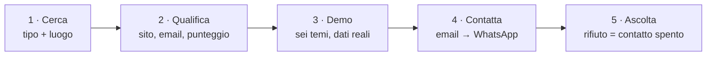

<div align="center">

# Lead Machine

**Trova le attività locali senza un sito decente, costruisce per ognuna una demo con i loro dati veri, e le contatta.**

[](https://github.com/iAlias/search-lead-google/actions/workflows/ci.yml)
[](LICENSE)
[](package.json)
[](https://nextjs.org)
[](tsconfig.json)
[](prisma/schema.prisma)

</div>

---

Scrivi `parrucchiere` e `Catania`. Il programma cerca su Google Maps, per ogni attività verifica se
il sito esiste ed è decente, ne recupera telefono ed email, calcola quanto vale come contatto, e
prepara una pagina dimostrativa con **le foto, gli orari e le recensioni reali di quel negozio**.
Poi manda l'email, e dopo qualche giorno il promemoria su WhatsApp — fermandosi da solo con chi
risponde e per sempre con chi dice di no.

Niente porta a porta, niente liste comprate, nessun dato inventato.



---

## Avvio

Serve Node.js 20 o superiore. Tre comandi:

```bash
npm install          # installa tutto (scarica anche Chromium per lo scraping)
npm run db:push      # crea il database SQLite
npm run dev          # http://localhost:3000
```

Apri **http://localhost:3000**, scrivi tipo di attività e luogo, premi **Avvia ricerca**.
Funziona anche senza nessuna chiave API: ogni pezzo che non è configurato degrada in modo
prevedibile, e la pagina **Impostazioni** dice sempre cosa è attivo davvero e cosa no.

> **Stai aggiornando un'installazione esistente?** Dopo `npm run db:push` lancia una volta sola
> `npm run db:backfill`: calcola i punteggi dei lead già salvati e toglie la chiave Google dalle
> foto scritte dalle versioni precedenti.

---

## Il flusso, passo per passo

1. **Cerca** — tipo di attività più città, regione o nazione. Con la chiave Places arrivano anche
   orari, recensioni e foto; senza, si passa allo scraping diretto di Maps.
2. **Qualifica** — ogni attività riceve un punteggio da 0 a 100 (sito assente o scadente,
   raggiungibilità, recensioni, reputazione) e il giudizio sul sito arriva **con i motivi in
   chiaro**: sono gli argomenti da usare quando ti chiedono «perché dovrei rifarlo?».
3. **Demo** — un wizard sceglie tema, sezioni, titolo e colore; la pagina viene generata con i dati
   di quell'attività e pubblicata su `/demo/<slug>`. Sei temi, ognuno con la sua palette, la sua
   tipografia e le sue meccaniche di scroll.
4. **Contatta** — email a chi ha un indirizzo, promemoria WhatsApp dopo N giorni a chi non risponde,
   telefonata suggerita quando anche quello cade nel vuoto. Il giro procede in background: puoi
   chiudere il browser, e puoi fermarlo a metà.
5. **Ascolta** — aperture, rimbalzi, segnalazioni spam e risposte rientrano nel sistema. Un «no
   grazie» spegne il contatto su tutti i canali, per sempre.

---

## Configurazione

Tutte le variabili stanno in `.env` (parti da `.env.example`) e sono **tutte opzionali**.

| Variabile | Serve per | Senza |
|---|---|---|
| `GOOGLE_PLACES_API_KEY` | ricerca veloce e completa: orari, recensioni, foto | scraping di Google Maps con Puppeteer, più lento e più fragile |
| `RESEND_API_KEY` + `EMAIL_FROM` | inviare email vere | le email vengono solo scritte in console (prova a vuoto) |
| `RESEND_WEBHOOK_SECRET` | sapere chi apre, chi rimbalza e chi ti segnala come spam | quegli eventi non arrivano: continueresti a scrivere a indirizzi morti |
| `ANTHROPIC_API_KEY` | testi della demo scritti dall'AI | testo predefinito, diverso per categoria |
| `CRON_SECRET` | far partire invii e follow-up da soli | partono solo premendo il pulsante |
| `APP_PASSWORD` | proteggere l'app con una password | nessuna protezione: chiunque raggiunga l'indirizzo entra |
| `APP_URL` | i link dentro email e demo | si assume `http://localhost:3000` |

<details>
<summary><b>Google Places</b> — la chiave consigliata</summary>

Crea una chiave su [console.cloud.google.com](https://console.cloud.google.com) e abilita
**Places API (New)**. I crediti gratuiti mensili coprono largamente un uso normale.

Le foto non vengono mai scritte con la chiave dentro: le demo puntano a `/api/photo`, che la
aggiunge lato server. Una demo è una pagina pubblica, e una chiave nel sorgente è una chiave persa.
</details>

<details>
<summary><b>Resend</b> — per inviare davvero, e per sapere com'è andata</summary>

Registrati su [resend.com](https://resend.com), crea una API key e **verifica il dominio mittente**.
Il piano gratuito copre 100 email al giorno.

Poi crea un webhook verso `<APP_URL>/api/webhooks/resend` con gli eventi *opened*, *bounced* e
*complained*, e metti il segreto in `RESEND_WEBHOOK_SECRET`. Un rimbalzo permanente o una
segnalazione spam spengono il contatto da soli: è la differenza fra un dominio che consegna e uno
che finisce in blacklist.
</details>

<details>
<summary><b>Invii automatici</b> — il follow-up che parte senza di te</summary>

```bash
curl -X POST -H "x-cron-secret: $CRON_SECRET" http://localhost:3000/api/cron
```

Una o due volte al giorno, con `cron` o con l'Utilità di pianificazione di Windows. Ogni passaggio
recupera le ricerche rimaste appese, cancella i dati scaduti e fa partire il giro di invii
rispettando i limiti giornalieri.
</details>

<details>
<summary><b>Password</b> — quando l'app esce da localhost</summary>

Imposta `APP_PASSWORD` e tutto ciò che non deve essere pubblico chiede di entrare. Restano
raggiungibili senza autenticazione solo le pagine che lo devono essere per forza: la demo del
cliente, le sue foto, la disiscrizione, l'informativa e i due ingressi automatici (webhook e cron,
protetti dai loro segreti).
</details>

---

## WhatsApp

Pagina **WhatsApp** → **Connetti** → inquadra il QR con l'app (Dispositivi collegati).

È il metodo non ufficiale (`whatsapp-web.js`), quindi due avvertenze concrete: il computer deve
restare acceso durante gli invii, e i limiti giornalieri vanno rispettati. Fra un messaggio e il
successivo il sistema aspetta da solo 30-90 secondi: è l'unica difesa contro il blocco del numero.

I messaggi in arrivo vengono letti. Un rifiuto spegne il contatto anche via email, e chi risponde
qualunque cosa non riceve più il promemoria.

---

## Privacy e conformità

I dati sono pubblici, ma restano dati personali quando dietro un'attività c'è una persona. Il
programma si comporta di conseguenza — e questa parte non è opzionale né disattivabile:

- **Disiscrizione con un clic**, con link firmato crittograficamente e intestazioni
  `List-Unsubscribe` / `List-Unsubscribe-Post` (RFC 8058), quelle che Gmail e Outlook pretendono
  dal 2024. Il link agisce solo su conferma esplicita: una scansione automatica della posta non può
  disiscrivere nessuno per sbaglio, e nessuno può spegnere l'indirizzo di un altro.
- **Informativa** pubblicata su `/privacy` e collegata in fondo a ogni messaggio, come richiede
  l'art. 14 GDPR quando i dati non li ha forniti l'interessato.
- **Esclusione permanente e valida su tutti i canali**: chi chiede di essere lasciato in pace non
  viene più contattato, nemmeno approvandolo di nuovo a mano in seguito.
- **Un contatto, un messaggio**: la stessa attività trovata in due ricerche diverse riceve un solo
  messaggio.
- **Cancellazione automatica** dei contatti mai raggiunti dopo il numero di giorni impostato.
- **Registro** di ogni invio, apertura, rimbalzo e risposta, consultabile nella scheda del lead.

Compila nome ed email di contatto in **Impostazioni**: finiscono nell'informativa, e sono ciò che
rende il tutto riconducibile a una persona vera. Per un uso continuativo come professionista,
regolati con partita IVA e informativa tua.

---

## Struttura

```
src/
├─ app/
│  ├─ page.tsx                  ricerca e stato delle campagne
│  ├─ leads/                    lista lead, scheda, wizard della demo
│  ├─ privacy/                  informativa pubblica
│  ├─ demo/[slug]/              la pagina che vede il cliente
│  └─ api/
│     ├─ campaigns/ leads/      dati e azioni della dashboard
│     ├─ outreach/run           avvio, stato e arresto del giro di invii
│     ├─ photo/                 proxy delle foto: la chiave resta sul server
│     ├─ unsubscribe/           disiscrizione firmata (GET conferma, POST agisce)
│     ├─ webhooks/resend/       aperture, rimbalzi, segnalazioni spam
│     └─ cron/                  ingresso automatico, protetto da segreto
├─ lib/
│  ├─ outreachPlan.ts           chi contattare e chi no ·  funzione pura
│  ├─ leadScore.ts              quanto vale un contatto ·  funzione pura
│  ├─ websiteCheck.ts           il sito è scadente? e perché ·  funzione pura
│  ├─ replies.ts                rifiuto o interesse ·  funzione pura
│  ├─ photos.ts                 nessuna chiave nelle pagine pubbliche ·  funzione pura
│  ├─ signing.ts                firma dei link e delle sessioni ·  funzione pura
│  ├─ demoGenerator.ts          i sei temi, HTML completo
│  ├─ outreach.ts  jobs.ts      esecuzione degli invii in background
│  ├─ inbound.ts   events.ts    risposte in arrivo e registro
│  ├─ places.ts    mapsScraper.ts  emailScraper.ts   raccolta dati
│  └─ whatsapp.ts  email.ts     i due canali
└─ middleware.ts                protezione con password, se configurata
```

---

## Sviluppo

| Comando | Cosa fa |
|---|---|
| `npm run dev` | ambiente di sviluppo su :3000 |
| `npm test` | **97 test**, nessun server e nessun database richiesti |
| `npm run build` | build di produzione |
| `npm run db:push` | allinea il database allo schema Prisma |
| `npm run db:backfill` | sistema i dati salvati dalle versioni precedenti |

Le decisioni che si pagano care quando sbagliano — chi contattare, quando smettere, come giudicare
un sito, come firmare un link — stanno in **funzioni pure**, senza database e senza rete, ognuna con
i suoi test. Il resto del codice le esegue e basta. È il motivo per cui `npm test` gira in mezzo
secondo e copre le parti che contano davvero.

---

## Limiti, detti chiaramente

- **Places API**: circa 60 risultati per interrogazione. Per coprire una città grande servono più
  ricerche con termini diversi (pizzeria, trattoria, ristorante…).
- **Scraping di Maps**: dipende dal layout di Google, può rallentare o saltare qualche scheda. Con
  la chiave Places è tutto più affidabile.
- **Email**: si trova leggendo il sito dell'attività. Chi non ha un sito si raggiunge solo su
  WhatsApp.
- **Serve un processo sempre acceso**: SQLite, Puppeteer, WhatsApp e il giro di invii in background
  vogliono una macchina che non si spenga fra una richiesta e l'altra. Non è pensato per il
  serverless.
- **Nessun dato di esempio**: quello che vedi nella dashboard è stato raccolto in quel momento.

---

## Licenza

[MIT](LICENSE).
